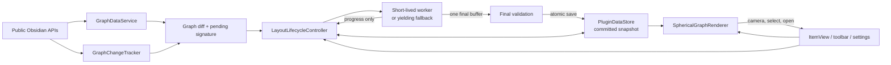
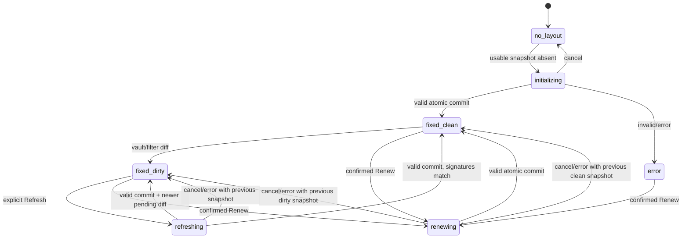

# Architecture

Spherical Graph separates Obsidian integration, graph data, layout computation,
committed persistence, and rendering so the fixed-layout invariant can be
tested without WebGL or a real vault.

## Modules

- `src/graph` builds a deterministic path-indexed graph from Markdown files and
  `MetadataCache.resolvedLinks`, filters data, signs descriptors, computes
  detailed diffs, debounces vault events, and computes the O(V + E) union of
  every unweighted shortest route. It has no dependency on the solver.
- `src/geometry` contains pure vector, geodesic, exponential-map, SLERP,
  geodesic-arc, hash/PRNG, and proper-rotation alignment functions.
- `src/layout` owns initialization, force evaluation, exact and sampled
  repulsion, Refresh planning and anchoring, the batch solver, worker protocol,
  worker entry point, and the lifecycle state machine.
- `src/persistence` validates untrusted stored data, migrates schema versions,
  reconciles current paths with a committed snapshot, and serializes atomic
  layout commits separately from debounced settings/camera writes.
- `src/render` owns Three.js resources: the sphere, one instanced node layer,
  a muted dashed graticule, batched geodesic edges, selected/route ribbons,
  endpoint rings, an instanced tag-satellite layer with batched spiral links,
  bounded zoom-gated labels, picking, camera controls, theme and resize
  handling, and deterministic disposal.
- `src/view` owns the ItemView, toolbar, fuzzy search, status presentation, and
  responsive selection-details panel, ephemeral route-picking state, and
  callback interfaces. It does not call the solver directly. The panel derives
  direct neighbors from the validated render snapshot, and route highlighting
  never mutates committed positions.
- `src/settings` supplies typed defaults, strict parsing/clamping, and a
  settings tab that reports whether a change is visual, data, or future-layout
  configuration.
- `src/main.ts` is composition glue: registration, public Obsidian events,
  commands, view activation, service ownership, and teardown.

## Lifecycle state machine

`LayoutLifecycleController` is the only owner of layout state transitions.

At most one operation exists. A worker message is accepted only when its
`operationId`, mode, and captured input graph signature match the active
operation. Late messages from a terminated worker are ignored. Fixed states
have no active worker or solver.

## Committed and working state

The renderer and data store reference only the last committed snapshot.
Starting Initialize, Refresh, or Renew creates independent typed arrays:
positions, velocities, forces, graph endpoints and weights, movable masks, and
optional anchors. These working arrays are never written to persistence or
passed to the renderer.

Progress contains scalar diagnostics. A `completed` message contains the first
and only position buffer transfer. The main thread validates:

1. operation identity and captured graph signature;
2. exact buffer length for the captured node order;
3. finite, non-zero values and unit-norm tolerance;
4. Refresh old-node displacement limits;
5. current expected snapshot ID, preventing lost updates.

Only then does one `saveData` replace the committed snapshot and one renderer
call replace geometry. Cancel, failure, stale completion, view close, or invalid
data discards the working result.

## Vault change flow

Typed public vault and metadata events enqueue a debounced graph rebuild.
Rename events also carry the old and new path as a reliable hint. The resulting
descriptor is compared to the committed descriptor.

- An active-file event changes highlight only.
- A non-empty graph diff moves a fixed state to `fixed-dirty`.
- Existing committed nodes remain at their exact vectors.
- New nodes without committed vectors stay pending and are not rendered.
- Deleted nodes and incident edges are omitted immediately.
- Reliable renames migrate the saved position.
- No vault event calls Refresh or creates a worker.

Changes observed during an operation update the current pending signature but
do not restart it. A successful result remains associated with the captured
input; if the live graph changed meanwhile, the post-commit state is dirty.

## Worker protocol and fallback

The discriminated protocol supports:

- main → worker: `run`, `cancel`, `dispose`;
- worker → main: `started`, rate-limited `progress`, one `completed`,
  `cancelled`, or `error`.

`progress` intentionally has no position field. The completed `Float32Array`
buffer is transferable. Every terminal path terminates the worker and revokes
its Blob URL.

`esbuild.config.mjs` first bundles `worker-entry.ts` as a browser IIFE in
memory. A virtual module embeds that source string into the main bundle.
Runtime worker creation uses a temporary Blob URL, so the installed plugin
still needs only `main.js`, `manifest.json`, and `styles.css`.

If worker creation is unavailable, the same pure solver runs in bounded batches
that yield to the owner window's event loop. It preserves final-only rendering,
cancellation, and validation semantics.

## Renderer lifecycle

The renderer is constructed lazily in `ItemView.onOpen`, using the view's
`ownerDocument` and `defaultView` so pop-out windows are supported. Rendering
is invalidation-based: camera changes, an atomic snapshot, selection, visible
topology, resize, theme, or focus animation schedule a frame. There is no
permanent 60 fps loop in a fixed state.

The WebGL graticule is a low-contrast dashed `LineDashedMaterial`; document
links remain brighter continuous geodesic lines. Route endpoints use separate
start/destination colors and double tangent rings. The DOM
`SelectionDetailsPanel` is a sibling overlay over the same stage and opens
notes only through the view callback supplied by `main.ts`.

Tags are obtained from the public Obsidian metadata cache during graph-model
rebuilds, but are deliberately excluded from the graph descriptor and solver
signature. `createRenderGraphSnapshot` aggregates them only for currently
committed visible notes. A metadata-only tag change therefore rebuilds the
derived renderer snapshot through `GraphChangeTracker.onObservation` without
creating a layout diff, worker, persistence write, or node movement.

`TagLayer` draws one instanced satellite mesh for every tag and one batched
line object for all currently relevant note-to-tag links. It owns no carrier
sphere mesh. Orbit height is a validated appearance setting and rebuilds only
the derived marker matrices and active spiral batch. The marker shader and DOM
labels independently test whether the main globe intersects the camera-to-tag
segment. An optional, default-off camera-axis guard adds the former center-line
fade when requested; DOM tag labels mirror it and are bounded to 96.

`onClose`/plugin unload cancels owned work, cancels RAF/timers, removes picking
events, disconnects resize/theme observers, disposes controls, geometries,
materials and WebGL state, terminates the worker, and revokes its URL.

## Persistence

The stored envelope contains schema version, validated settings, one committed
layout, and camera state. A committed layout contains its algorithm version,
graph signature/descriptor, path-to-unit-vector map, mode, completion time,
effective seed, and committed Renew generation. It never stores velocity,
temperature, working buffers, or a resumable solver.

Settings and camera changes are debounced and merged independently. They cannot
reconstruct or mutate the position map. A successful Renew increments
`renewGeneration`; a cancelled or failed Renew cannot.
