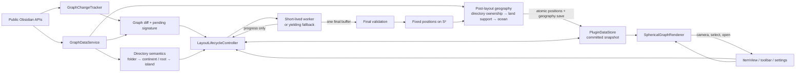
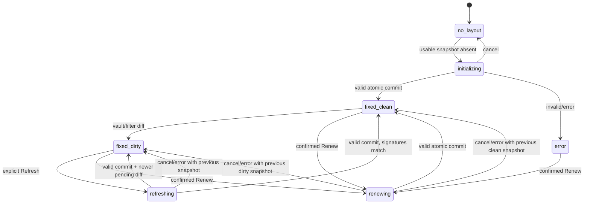

# Architecture

Spherical Graph separates Obsidian integration, graph data, layout computation,
committed persistence, and rendering so the fixed-layout invariant can be
tested without WebGL or a real vault.

## Modules

- `src/graph` builds a deterministic path-indexed graph from Markdown files and
  `MetadataCache.resolvedLinks`, filters data, signs descriptors, computes
  detailed diffs, debounces vault events, and computes the O(V + E) union of
  every unweighted shortest route. It has no dependency on the solver.
- `src/geometry` contains pure vector, geodesic, exponential-map, SLERP,
  geodesic-arc, hash/PRNG, and proper-rotation alignment functions.
- `src/geography` defines top-level-folder continent ownership, first-two-level
  selection regions, linked-root-note islands, and orphan water markers. After
  a completed solve it re-derives centers, diagnostic extents, conductance,
  stable identity/color matching, and the persisted geography descriptor.
- `src/layout` owns directory-aware multi-level initialization, reduced
  cross-folder spring weights, bounded sparse graph-distance stress,
  folder-centroid coverage, relative coastal-port placement, render-aware S²
  collision projection, exact and sampled repulsion, Refresh planning and
  anchoring, the batch solver, worker protocol, worker entry point, and the
  lifecycle state machine. Render-time land ownership never feeds back into the
  solver.
- `src/persistence` validates untrusted stored data, migrates schema versions,
  reconciles current paths with a committed snapshot, and serializes atomic
  layout and pin commits separately from debounced settings/camera writes.
- `src/render` owns Three.js resources: the ocean sphere, a batched icosphere
  land mesh, deterministic coastlines and island patches, cartographic region
  labels, one instanced node layer, a muted dashed graticule, batched geodesic
  edges, selected/route ribbons,
  endpoint rings, an instanced polished-silver tag-satellite layer with batched
  spiral links, instanced map pins, a procedural cloud atmosphere, bounded
  zoom-gated labels and roads, picking, manual and optional automatic camera
  controls, theme and resize handling, and deterministic disposal.
- `src/view` owns the ItemView, toolbar, fuzzy search, status presentation, and
  responsive selection-details panel, ephemeral route-picking state, and
  callback interfaces. It does not call the solver directly. The panel derives
  direct neighbors from the validated render snapshot, and route highlighting
  never mutates committed positions.
- `src/settings` supplies typed defaults, strict parsing/clamping, and a
  settings tab that reports whether a change is visual, data, or future-layout
  configuration.
- `src/main.ts` is composition glue: registration, public Obsidian events,
  commands, view activation, service ownership, and teardown.

## Lifecycle state machine

`LayoutLifecycleController` is the only owner of layout state transitions.

At most one operation exists. A worker message is accepted only when its
`operationId`, mode, and captured input graph signature match the active
operation. Late messages from a terminated worker are ignored. Fixed states
have no active worker or solver.

## Committed and working state

The renderer and data store reference only the last committed snapshot.
Starting Initialize, Refresh, or Renew creates independent typed arrays:
positions, velocities, forces, graph endpoints and weights, sparse target
angles, directory/region indexes, collision radii, port hints, movable masks,
and optional Refresh anchors. Render-time land rasters and coastlines do not
exist in the solver payload. These working arrays are never written to
persistence or passed to the renderer.

Progress contains scalar diagnostics. A `completed` message contains the first
and only position buffer transfer. The main thread validates:

1. operation identity and captured graph signature;
2. exact buffer length for the captured node order;
3. finite, non-zero values and unit-norm tolerance;
4. Refresh old-node displacement limits;
5. current expected snapshot ID, preventing lost updates.

Only then does one `saveData` replace the committed snapshot and one renderer
call replace geometry. Cancel, failure, stale completion, view close, or invalid
data discards the working result.

## Vault change flow

Typed public vault and metadata events enqueue a debounced graph rebuild.
Rename events also carry the old and new path as a reliable hint. The resulting
descriptor is compared to the committed descriptor.

- An active-file event changes highlight only.
- A non-empty graph diff moves a fixed state to `fixed-dirty`.
- Existing committed nodes remain at their exact vectors.
- New nodes without committed vectors stay pending and are not rendered.
- Deleted nodes and incident edges are omitted immediately.
- Reliable renames migrate the saved position.
- No vault event calls Refresh or creates a worker.

Changes observed during an operation update the current pending signature but
do not restart it. A successful result remains associated with the captured
input; if the live graph changed meanwhile, the post-commit state is dirty.

## Worker protocol and fallback

The discriminated protocol supports:

- main → worker: `run`, `cancel`, `dispose`;
- worker → main: `started`, rate-limited `progress`, one `completed`,
  `cancelled`, or `error`.

`progress` intentionally has no position field. The completed `Float32Array`
buffer is transferable. Every terminal path terminates the worker and revokes
its Blob URL.

`esbuild.config.mjs` first bundles `worker-entry.ts` as a browser IIFE in
memory. A virtual module embeds that source string into the main bundle.
Runtime worker creation uses a temporary Blob URL, so the installed plugin
still needs only `main.js`, `manifest.json`, and `styles.css`.

If worker creation is unavailable, the same pure solver runs in bounded batches
that yield to the owner window's event loop. It preserves final-only rendering,
cancellation, and validation semantics.

## Directory geography pipeline

The first path segment is the authoritative continent key. Initialize and Renew
allocate deterministic macro centers, split folders into subdirectory and
topology cohorts with a linear strongest-road DFS sweep, grow irregular district
centers, and adaptively best-candidate-place notes without emitting any hard
territory. Same-folder springs retain full weight, cross-folder springs are
reduced, bounded landmark constraints preserve longer graph distances, and
coverage acts on folder centroids. Root notes are islands; orphans are seeded
ocean scatter. Refresh uses an orphan-only initializer when that is the only
new placement it needs.

After force convergence, relative inter-folder link evidence moves only a small,
directionally coherent set of port cities toward the observed edge of their
own folder distribution. A deterministic S² projection then resolves remaining
marker overlap using radii derived from the current visual Globe size. Refresh
fixed masks and anchor cones are enforced by both post-processes.

After validation, `postLayoutGeography` groups all linked folder notes by their
top-level path, makes linked root notes islands, and omits orphans from land.
It derives centers and diagnostic extents from the fixed vectors and preserves
identity/color by full-path or relative-path membership overlap. The renderer
then builds adaptive member/road support with exclusive ownership and expands
only the connected external ocean until visible water is approximately 52%.
Multi-scale spherical erosion bias makes weak coastal sectors retreat into
broad bays without moving or excluding protected member cities.

The analytical grid, density samples, watershed labels, and cell ownership are
temporary. The atomic snapshot persists fixed note vectors and compact semantic
geography, not the analytical surface.

## Renderer lifecycle

The renderer is constructed lazily in `ItemView.onOpen`, using the view's
`ownerDocument` and `defaultView` so pop-out windows are supported. Rendering
is invalidation-based: camera changes, an atomic snapshot, selection, visible
topology, resize, theme, or focus animation schedule a frame. A continuous
frame loop exists while the user-enabled **Auto rotate** control is active or
the visible cloud atmosphere advances. A manual camera gesture pauses globe
rotation and schedules its restart three seconds after the last interaction;
it does not clear the persistent switch.

The WebGL graticule is a low-contrast dashed `LineDashedMaterial`; document
links remain continuous geodesic roads with a separate material. `SphereLayer`
derives a single-owner land mesh and coastline batch from the committed
geography. `landGeometry` evaluates deterministic anisotropic multi-scale
support, clips mixed icosphere triangles at the exact ownership transition,
draws the outer mask as sand, and overlays a variably inset land interior.
Detailed bays, headlands, and the irregular beach band are therefore smooth
rather than aligned to mesh cells.
`landSupport` excludes degree-zero notes, keeps every linked directory member,
and retreats weak coastal ownership from the already connected ocean until the
52% target plus bounded root-island compensation is reached. A precomputed
smooth spherical bias varies the retreat rate at three scales. Protected member
cells remain land, so this render-only retreat widens seas and carves
headlands/bays without changing positions or creating inland holes.
The land and ocean `ShaderMaterial`s generate their atlas texture from local
sphere direction, requiring no texture files or runtime I/O. The ocean depth
skin sits slightly inside the logical globe so land, graticule, roads, and
cities retain stable depth ordering across GPU depth buffers. Ocean and
geographic materials remain independent of graph links.
The camera widens its vertical field of view in portrait-like panes to preserve
horizontal globe framing, while the label layer applies a viewport-area display
budget below the user-configured maximum. Route endpoints use separate
start/destination colors and double tangent rings. The DOM
`SelectionDetailsPanel` is a sibling overlay over the same stage and opens
notes only through the view callback supplied by `main.ts`.

Tags are obtained from the public Obsidian metadata cache during graph-model
rebuilds, but are deliberately excluded from the graph descriptor and solver
signature. `createRenderGraphSnapshot` aggregates them only for currently
committed visible notes. A metadata-only tag change therefore rebuilds the
derived renderer snapshot through `GraphChangeTracker.onObservation` without
creating a layout diff, worker, persistence write, or node movement.

`TagLayer` draws one smaller polished-silver instanced satellite mesh for every
tag and one batched silver line object for all currently relevant note-to-tag
links. It owns no carrier sphere mesh. Orbit height is a validated appearance
setting and rebuilds only the derived marker matrices and active spiral batch.
Marker, link, and DOM-label visibility recedes with perspective depth. The
marker and every link segment independently test whether the main globe blocks
the camera ray, including when the ocean surface is transparent or hidden. An
optional, default-off camera-axis guard adds the former center-line fade when
requested; DOM tag labels mirror it and are bounded to 96.

`AtmosphereLayer` owns one front-sided procedural cloud mesh with no texture
asset or opaque carrier shell. It appears only at wider zoom while Auto rotate
is requested, unless fullscreen presentation explicitly forces it. Sparse
multi-scale cloud alpha and a broken limb avoid a glass-envelope silhouette;
the shell advances once per ten minutes relative to the graph group.

`PinLayer` renders persistent favourites as instanced radial shafts and heads.
It consumes stable node IDs, applies the same render-only filters as cities,
and never changes the committed coordinates or picking topology.

`onClose`/plugin unload cancels owned work, cancels RAF/timers, removes picking
events, disconnects resize/theme observers, disposes controls, geometries,
materials and WebGL state, terminates the worker, and revokes its URL.

## Persistence

The stored envelope contains schema version, validated settings, one committed
layout, camera state, and sorted vault-relative pinned-note paths. A committed
layout contains its algorithm version,
graph signature/descriptor, path-to-unit-vector map, post-layout spatial
continents, island IDs, geographic centers/diagnostic extents/colors, mode,
completion time, effective seed, and committed Renew generation. It never
stores velocity, temperature, analytical grid cells, watershed state, land
triangles, working buffers, or a resumable solver.

Settings and camera changes are debounced and merged independently. Desired pin
mutations are serialized atomically so concurrent graph views cannot overwrite
one another; renames migrate pins, while an actual vault-delete event removes
the deleted path. Startup deliberately does not prune temporarily missing pins,
because Obsidian Sync can deliver community-plugin data before note files.
**Save map** folds every pending field into one complete write. The canonical
Obsidian plugin `data.json` is therefore sufficient for restart stability and
for Obsidian Sync when community-plugin data syncing is enabled. These writes
cannot reconstruct or mutate the position map. A successful Renew increments
`renewGeneration`; a cancelled or failed Renew cannot.
