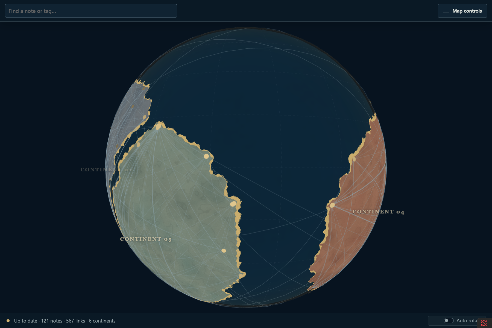
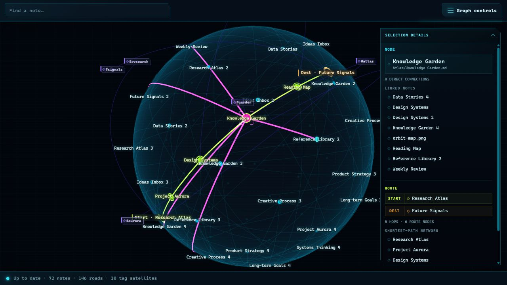
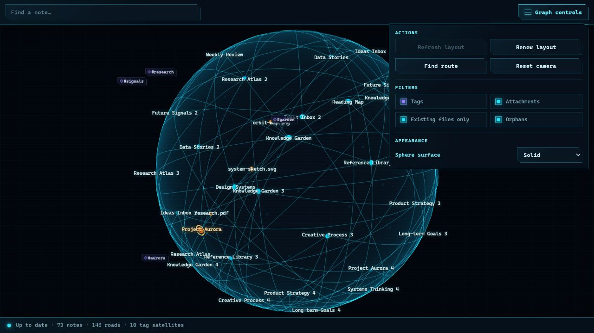

# Spherical Graph

[](https://github.com/Pavel-mik/obsidian-spherical-graph/actions/workflows/ci.yml)
[](https://github.com/Pavel-mik/obsidian-spherical-graph/releases)
[](LICENSE)

Turn your Obsidian vault into an explorable world. Each top-level vault folder
becomes its own continent, notes become cities, links become roads across the
surface, and tags orbit overhead as satellites. Linked notes stored directly
in the vault root become islands; orphan notes remain cities over open water.
The cartography reserves approximately half the globe for one connected ocean.
Route Finder reveals every shortest path between distant notes.

Spherical Graph is designed as a stable spatial map: a finite layout operation
computes positions, validates and saves one complete snapshot, and then stops.
Normal reading, search, filtering, selection, rotation, zoom, theme changes,
and resizing do not move notes.

Initialize and Renew first allocate deterministic intrinsic spherical
territories to the top-level folders. Same-folder topology arranges cities
inside each territory; cross-folder links have reduced layout weight and can
move endpoints without transferring them to another continent. After the
finite solver stops, adaptive land support over the fixed positions produces
exclusive coastlines, beaches, root-note islands, and one broad ocean.

## See your vault as a world







## Requirements

- Obsidian 1.7.2 or later.
- Desktop app. The renderer, worker lifecycle, and resource profile are not
  supported on mobile.
- No account, API key, internet connection, or paid service is required.

## Why a sphere?

This is not a conventional 3D force graph with important notes near the center
and other notes floating in a volume. Every node is represented internally by
a unit vector \(u \in S^2\), and its rendered point is \(R u\). The solver uses
geodesic angular distance, tangent-plane forces, and exponential-map updates
directly on the sphere. Edges are sampled as shortest geodesic arcs on the
surface rather than drawn as straight chords through the globe.

The result has no left/right map seam. Notes near longitudes \(+180^\circ\) and
\(-180^\circ\) are genuinely close because longitude is not a layout
coordinate.

## Fixed-layout lifecycle

Spherical Graph has three finite layout operations:

- **Initialize** runs automatically only when no usable saved layout exists.
- **Refresh layout** incorporates pending vault changes while preserving the
  existing mental map. New nodes warm up while old nodes are fixed; then only a
  local affected set may relax under geodesic anchors and a maximum angular
  displacement.
- **Renew layout** is an explicit, confirmed, whole-map regeneration. It uses a
  new deterministic effective seed and does not use old positions as anchors.

While Refresh or Renew runs, the last committed map remains visible and
interactive. Progress messages contain diagnostics only. The renderer receives
new coordinates once, after the complete result passes operation-ID, graph
signature, length, finiteness, unit-norm, and Refresh-displacement checks. A
validated final buffer becomes immutable input to the post-layout geographic
analysis before the complete snapshot is saved atomically. A cancelled, stale,
invalid, or failed operation leaves the previous snapshot untouched.

Vault changes never start a solver automatically. Instead the view reports a
pending state such as:

```text
Changes detected · +7 / -2 notes · 11 link changes
```

New notes without committed positions remain pending; deleted notes disappear;
and a reliable rename keeps the old position under the new path. Select
**Refresh layout** when you want to incorporate the pending graph.

## Features

- Dedicated `Spherical Graph` ItemView, ribbon action, and command-palette
  commands.
- Intrinsic, seam-free spherical layout with deterministic exact and sampled
  repulsion modes.
- Directory-aware Initialize/Renew placement directly on \(S^2\): each
  non-orphan top-level folder owns a deterministic territory, internal links
  retain full spring weight, cross-folder links are weaker, and hard geodesic
  boundaries prevent continental overlap.
- Post-layout cartography over fixed positions uses adaptive member and
  same-folder-road support, exclusive land ownership, irregular coastlines,
  and one connected ocean targeting approximately half the globe.
- Degree-zero notes stay as cities over water. Degree-one/two folder notes
  remain on their continent; only linked root notes receive island patches.
- Membership matching preserves stable continent identity and color across
  compatible Refreshes and multi-note top-level folder renames.
- Incremental Refresh with a new-node warm-up, graph-neighborhood affected set,
  hard-fixed remote nodes, anchors, and a displacement cap.
- Transactional committed snapshot, schema migrations, stable camera state,
  and safe rename/prune handling.
- Short-lived inline Web Worker with final-only position transfer plus a
  yielding main-thread compatibility fallback.
- Three.js rendering with a matte ocean, batched topology-derived land,
  deterministic organic coastlines supported by actual member cities and
  short internal roads, an irregular sand beach band, sea carved by neighboring
  regions, islands, cartographic region labels, instanced tangent city markers,
  batched geodesic roads, a restrained dashed graticule, smoothly fading
  labels, responsive narrow-pane framing, and invalidation-based frames.
- Hover details, selection, linked-neighbor and same-subfolder emphasis,
  active-note emphasis,
  search/focus, open-note actions, camera reset, keyboard controls, and a
  translucent selection panel with clickable direct neighbors.
- Searchable excluded-folder picker in settings. Selecting a folder excludes
  its entire subtree after an explicit Refresh without moving the current map
  immediately.
- Offline route finding that highlights every shortest path between two notes
  over the existing links, including all equally short alternatives, explicit
  `Start` and `Dest` markers, and clickable route details.
- Intrinsically packed, render-only tag satellites on an adjustable, invisible
  concentric orbit. Their positions are anchored to the final locations of the
  notes that carry them.
  Thin amber spherical spirals connect tags to the selected note, every note
  in the active shortest-path union, or every note carrying a selected tag.
  Satellites hidden behind the globe are culled geometrically.
- Solid, transparent, and hidden sphere-surface modes.
- Render-only visibility filters for tags, attachments, unresolved links, and
  orphan notes. Filters hide markers and incident links without moving the map.
- Theme-aware colors, resize handling, pop-out owner-window awareness, and
  explicit resource cleanup.
- No telemetry, runtime network calls, external keys, or note-content writes.

## Controls

| Action | Control |
| --- | --- |
| Rotate | Drag empty canvas space |
| Zoom | Wheel or supported pinch gesture |
| Inspect | Hover a node |
| Select | Click a node |
| Select a tag and show its links | Click an amber tag satellite |
| Clear selection | Click empty canvas space or press `Escape` |
| Open note | Double-click a node or press `Enter` on a selected search result |
| Open in new tab | `Ctrl`/`Cmd` + click |
| Open from selection details | Click a selected, linked, endpoint, or route note; hold `Ctrl`/`Cmd` for a new tab |
| Hide or show selection details | Select the **Selection details** header |
| Find and focus | Type in **Find a note…** and choose a result |
| Find all shortest routes | Select an origin, open **Map**, choose **Find route**, then select a destination |
| Clear a route | Choose **Clear route** in **Map** |
| Hide categories without moving the map | Use **Filters** in **Map** |
| Hide or show geography | Toggle **Continents** in **Map → Appearance** |
| Change globe surface | Use **Appearance** in **Map** |
| Include pending changes | Choose **Refresh layout** in **Map** |
| Build a new world | Choose **Renew layout** in **Map**, then confirm |
| Stop a calculation | Choose **Cancel calculation** in **Map** |
| Restore view | Choose **Reset camera** in **Map** |

Dragging never changes a node position.

## Settings

### Data

- searchable excluded-folder picker with subtree semantics and removable paths
- graph-change debounce
- pending-diff detail limit

### Appearance

- relative **Globe size** and degree scaling; a larger Globe value makes city
  markers and the coral selection frame smaller without moving the layout.
  Initialize and Renew automatically choose this value from the vault's note
  count; Refresh preserves the current value
- tag-orbit height as a percentage of the globe radius (30% by default), plus
  an optional camera-axis protection guard, disabled by default
- edge opacity
- labels, maximum pooled labels, and a zoom-in threshold (0–100%); note and
  tag labels fade and scale smoothly around that threshold
- continent, coastline, island, and cartographic-label visibility
- sphere surface mode and opacity
- theme-following background
- focus-animation duration

### Layout

- deterministic base seed
- spring, repulsion, centroid, and isotropy strengths
- damping, step, angular-speed cap, convergence, and iteration budget
- exact-repulsion threshold and sampled negative count
- progress-report interval

### Refresh preservation

- new-node warm-up budget
- affected graph-neighborhood depth
- anchor strength and directly affected multiplier
- maximum old-node angular displacement
- large-change warning ratio

Visual settings apply without running a solver. The graph-menu filters for
tags, attachments, unresolved links, and orphan notes are also render-only.
Data exclusions can create pending changes. Layout settings apply to the next
relevant explicit operation; changing them alone does not move the current
map.

## Installation

After publication, install **Spherical Graph** from **Settings → Community
plugins → Browse**.

For a manual or beta installation:

1. Build the plugin or download a release.
2. Place these files directly in
   `<vault>/.obsidian/plugins/spherical-graph/`:

   - `main.js`
   - `manifest.json`
   - `styles.css`

3. Restart or reload Obsidian after the first install or an ID/manifest change.
4. Open **Settings → Community plugins**, enable **Spherical Graph**, and run
   **Spherical Graph: Open graph** from the command palette.

Do not create an extra nested repository directory; `manifest.json` must be
directly inside `.obsidian/plugins/spherical-graph/`.

## Development

Use a dedicated disposable development vault.

```powershell
npm ci
npm run dev
```

Quality and utility commands:

```powershell
npm run lint
npm run typecheck
npm run test
npm run test:coverage
npm run build
npm run validate:release
npm run check
npm run benchmark:layout
npm run generate:test-vault -- --output ./tmp/test-vault --nodes 500 --edges 1500 --seed 42 --pattern clustered
```

The production build writes the release artifacts to the repository root. The
layout worker source is embedded into `main.js`; no separate worker file is
required.

See [ARCHITECTURE.md](ARCHITECTURE.md), [ALGORITHM.md](ALGORITHM.md),
[MANUAL_TEST_PLAN.md](MANUAL_TEST_PLAN.md), and [VALIDATION.md](VALIDATION.md).
The complete implementation specification is preserved in
[docs/CODEX_TASK.md](docs/CODEX_TASK.md).

## Privacy and safety

Spherical Graph is designed for private, offline vault use:

- It reads Markdown file metadata, tags, and Obsidian's resolved-link index.
- It never modifies note contents and never accesses files outside the vault.
- It stores plugin settings, vault-relative note paths, normalized layout
  positions, graph descriptors, post-layout continent membership, diagnostic
  centers/extents, and camera state through Obsidian's plugin-data API. Tag
  satellites and analytical spherical-grid cells are derived at runtime and
  are not persisted.
- It performs no runtime network requests, telemetry, remote-code loading,
  advertising, or automatic plugin updates.
- It requires no account, payment, external key, or remote service.

## Support and security

- Report bugs and request features through
  [GitHub Issues](https://github.com/Pavel-mik/obsidian-spherical-graph/issues).
- Follow [CONTRIBUTING.md](CONTRIBUTING.md) before submitting a change.
- Report security problems using the private process in
  [SECURITY.md](SECURITY.md), not a public issue.

## Known limitations

- Desktop only; mobile interaction and resource behavior are not validated.
- Arbitrary non-planar graphs can still have crossing edges on a sphere.
- Labels are intentionally capped and fade with zoom, so not every visible
  note is labelled at every camera distance. Narrow panes can lower the
  on-screen label budget further without changing the configured maximum.
- Every tag has an instanced satellite marker, while visible tag text labels
  are capped at 96. Tags behind the globe are hidden; optional camera-axis
  fading can additionally protect the center of the view.
- Route highlighting shows the union of all shortest paths. When alternatives
  overlap, their shared sections are intentionally drawn once.
- Very large graphs use deterministic sampled global repulsion; this is an
  approximation rather than exact all-pairs force evaluation.
- The plugin stores one committed layout snapshot and has no layout undo
  history, edge bundling, overlapping/fuzzy continent membership, manual
  country editing, ghost nodes, or image export.
- Actual GUI verification performed for a release is recorded in
  [VALIDATION.md](VALIDATION.md); automated checks do not imply a manual GUI
  pass.

## Release

1. Run `npm ci` and `npm run check` from a clean checkout.
2. Update `manifest.json`, `package.json`, `versions.json`, and
   [CHANGELOG.md](CHANGELOG.md).
3. Push a tag exactly equal to the manifest version, without a leading `v`.
   The release workflow repeats the full check, verifies the tag/version,
   attests the build, and creates a draft release containing `main.js`,
   `manifest.json`, and `styles.css`.
4. Review and publish the draft GitHub release.
5. For the first directory submission, make the repository public, link GitHub
   at [community.obsidian.md](https://community.obsidian.md), choose
   **Plugins → New plugin**, and submit the repository URL.

The complete maintainer procedure is in
[docs/RELEASE_CHECKLIST.md](docs/RELEASE_CHECKLIST.md).

## License

[MIT](LICENSE). Third-party attributions are in
[THIRD_PARTY_NOTICES.md](THIRD_PARTY_NOTICES.md).
